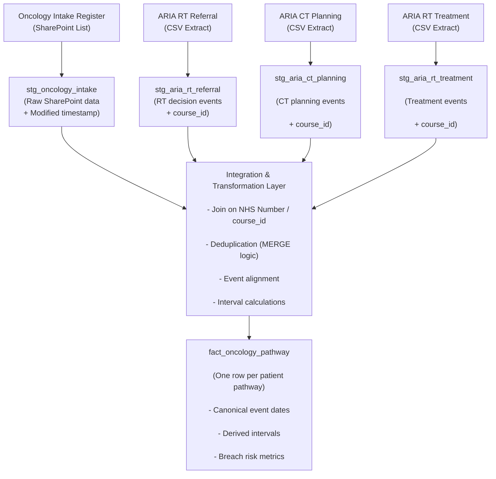
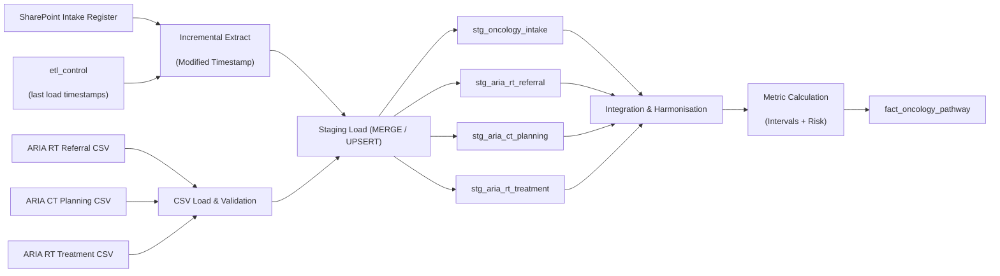
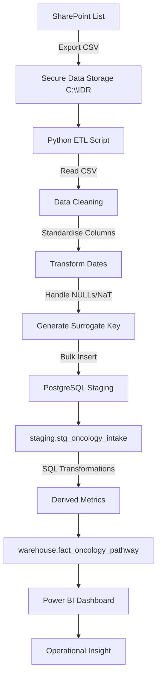

Having spent some time creating a simple ETL pipeline based on referral spreadsheet, the following has been developed:

## Integrated Data Repository for Oncology Pathways

#### Key capabilities:
- Ingests operational data from SharePoint (CSV export)
- Cleans and standardises inconsistent NHS data
- Stores data in structured PostgreSQL environment
- Enables derivation of pathway metrics
- Supports real-time operational insight (e.g. delay, risk)







## Core Components Built:
### 1. ETL Pipeline (Python)
- Reads CSV from secure location (PID separated)
- Cleans column names and data types
- Handles: 
	- missing values (NaT -> NULL)
	- encoding issues (BOM fix)
	- inconsistent naming
- Loads into PostgreSQL using bulk insert

### 2. Staging layer (PostgreSQL)

Schema:
``` SQL
staging.stg_oncology_intake
```

Purpose:
- raw but structured data
- Minimal transformation
- Data quality nprmalisation

### 3. Transformation Layer (SQL)
Derived metrics:
- referral -> triage time
- triage ->  clinic time
- Total pathway duration
- days since referral

### Analytical Model (Warehouse)

Begun building:
``` SQL
warehouse.fact_oncology_pathway
```
Purpose:
- Clean, analysis-ready dataset
- Supports dashboards and decision making

## Design Justification
### 1. Separation of Concerns
- ETL (Python) handles ingestion + cleaning
- PostgreSQL handles storage + querying
Improves maintainability
Reflects enterprise data architecture

### 2. Data Governance

Code and data kept on separate partitions:
- Code, syncing with GitHub on P:\ drive
- PID data on local hard drive C:\
This prevents accidental data leakage
Aligns with IG / GDPR principles


### 3. Robust ETL Design
Real-world data issues have been encountered and resolved:
- Missing identifiers -> surrogate keys
- NaT/NaN handling
- BOM encoding issue
- Column inconsistencies

### 4 IDR Architecture Choice
Built layers architecture:
- staging -> transformation -> analytics
Allows: 
- scalability
- reuse
- incremental updates

## Alignment to Research Objectives

### RQ1: Where delays occur
- Pathway decomposition:
	- triage
	- Clinic

### RQ2: Drivers of delay
- grouped by tumour site / clinician

### RQ3: Decision support
- risk flags and prioritisation

## Archetecture Diagram



## Data Flow
1. Data exported from SharePoint
2. Stored securely outside Git
3. ETL script:
	1. cleans + standardises data
	2. resolves quality issues
4. Data loaded into staging table
5. SQL transforms create metrics
6. Warehouse table supports analytics
7. Power BI visualises patient pathways & risk


