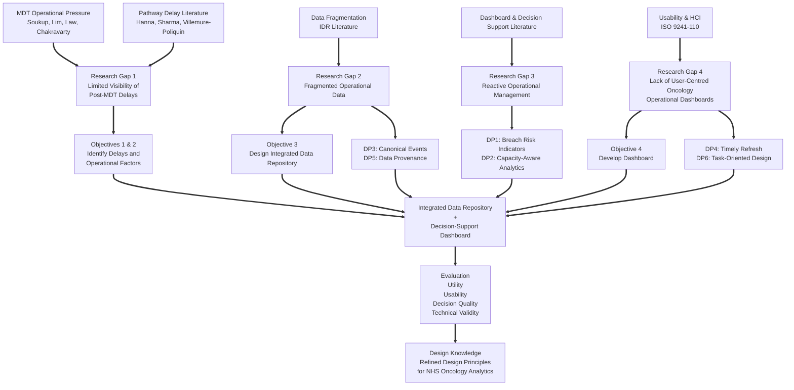

## Introduction

The purpose of this literature review is to synthesis and critically evaluate existing research relevant to the design of an Integrated Data Repository (IDR) and operational analytics dashboard aimed at improving post-MDT oncology pathway efficiency. Timely cancer treatment has profound implications for survival, patient experience, resource utilisation, and system performance. Evidence from national datasets, observational studies, systematic reviews, and informatics research shows that delays between MDT decisions and treatment initiation remain persistent across the NHS. Furthermore, data fragmentation, inconsistent recording practices, and limited visibility of operational bottlenecks hinder the ability of clinicians, MDT coordinators, and service managers to proactively manage these delays. 

The review is organised around five interrelated themes:

1. MDT operations and evolving pressures on multidisciplinary cancer decision making;
2. Operational delays across the cancer pathway, particularly diagnosis-to-treatment intervals (DTI);
3. Data fragmentation and the case for integrated data repositories;
4. Dashboards and performance-monitoring tools to support operational decision-making; and
5. Emerging data trends and the role of ETL, interoperability, AI and multimodal data integration.

Collectively, this literature forms the conceptual foundation (kernel theory) for the artefact developed in this study. The following sections provide a detailed account of these themes, integrating high-quality evidence from the UK, international datasets, clinical oncology, health informatics, and organisational science. 

## The NHS Cancer pathway and MDT Framework

### MDTs as the backbone of UK cancer care

Since the publication of the Calman-Hine report and subsequent interventions, MDT's have been embedded as the central governance structure for cancer decision making [@haward2006; @price2014; @morris2006; @morris2008]. The MDT model mandates that every new cancer case in the UK is discussed by a multidisciplinary panel including oncologists, surgeons, radiologists, pathologists, specialist nurses, and allied professionals. The 2024 NHS Wales MDT Charter emphasises the crucial role MDTs play in standardising care, reducing unwarranted variation, and improving outcomes by bringing domain experts together in real time [@nhswales2024]. Prospective benefits include higher adherence to guidelines, improved communication, shared decision-making, and better coordination of multi-modal treatment plans. 

However, the complexity of modern cancer care has increased dramatically alongside rising incidence, new treatment options, biomarker-based stratification, digital imaging volume, and genomic data availability. MDTs now contend with substantially larger case numbers, more complex diagnostic information, and resource pressures that stretch meeting capacity. Professional societies and national audits consistently highlight that MDT meetings are often over-subscribed, under-resourced, and administratively burdensome. These pressures compromise the quality of discussion and create operational bottlenecks that directly affect patient pathways. 

### Evidence if MDT operational pressures

Several studies provide evidence of the challenges affecting MDT functioning:

- @soukup2022 conducted a detailed observational analysis of 822 case discussions across three UK MDTs. Administrative/process issues occurred in 30% of cases, attendance problems in 16%, and equipment issues in 5%. These logistical challenges significantly reduced the quality of information and decision-making, demonstrating how operational inefficiencies detract from MDT effectiveness. 
- @lim2025 analysed 1488 UK HNC patients across 50 MDTs and found that compliance with key national cancer pathway standards was extremely low:
	- 28-day Faster Diagnosis Standards: **32.8%**
	- - 31‑day Decision‑to‑Treat standard: **33.3%**
	-  62‑day referral‑to‑treatment standard: **34.6%**
	- Median DTT-to-treatment was 42 days, highlighting pervasive delays within the MDT to treatment interface. 
- @chakravarty2023 demonstrated that patients referred via secondary-care outpatient pathways - rather than primary care cancer pathways - experienced significantly longer delays to MDT discussion and treatment initiation (mean 102 days vs. 88 days). These patients were also more likely to receive palliative rather than curative treatment (49% vs. 75%). 
- @law2024, in their scoping review protocol, identified numerous known MDT barriers from the last decade, including time pressures, communication challenges, patient selection issues, inconsistent attendance, information deficits, and increasing complexity of oncology care. 

### National policy direction and waiting time standards

NHS England's 2024/25 planning guidance emphasises compliance with the Faster Diagnosis Standard (FDS) and cancer treatment timeliness metrics (e.g. 31-day and 62-day pathways). These standards remain cornerstone performance indicators for cancer services, although operational pressures have made compliance increasingly difficult. The guidance highlights persistent waiting-time challenges, data-quality requirements, and the need for integrated pathway oversight tools to support improvement [@parker2026].

Radiotherapy services provide a specific example: the Royal College of Radiologists' 2024 briefing reports significant deterioration in treatment timeliness post-2022, with over 2,300 patients breaching the 31-day standard in October 2023 and substantial regional variation in access [@rcr2024]. Hidden waits - such as patients waiting up to 20 weeks between surgery and radiotherapy - are not systematically captured in national datasets, illustrating major limitations in operational visibility. 

These national data reinforce the argument that MDT-level and pathway-level operational delays cannot be sufficiently monitored using current fragmented systems. 

## Operational Delays in Cancer Pathways

### Diagnosis-to-treatment interval (DTI) as a critical metric

A robust body of literature demonstrates that prolonged DTI adversely affects survival across multiple cancer types. The association between delay and mortality is largely consistent, although the magnitude varies by tumour biology, treatment modality, and disease stage.

Key findings from the literature include:
- @hanna2020 conducted a major systematic review and meta-analysis (34 studies, 1.27 million patients). They found that each four-week delay in starting cancer treatment was associated with a 608% increase in mortality for most surgical indications, and significant risk increases across radiotherapy and systemic therapy indications. This landmark study established standardised delay-mortality estimates used widely in service planning. 
- @coca-pelaz2018 reviewed treatment delays in HNSCC and found  strong evidence of tumour progression with delays exceeding four weeks, including accelerated tumour-volume doubling and worse local control. 
- @sharma2016 analysed 6,606 OPSCC from the National Cancer Database (NCDB) and found that DI >30 days significantly reduced overall survival (HR 1.12). Each additional week of delay increased mortality risk by 2.2%. 
- @villemure-poliquin2025 synthesised 63 studies involving 873,718 HNC patients. Tehir meta-analysis showed that initiating treatment within 30 days improved overall survival by 9%, although heterogeneity across tumour sites and definitions of delay was high. 
- @saleh2024 examined 32,340 cervical cancer cases and showed that survival decreases sharply after the first 30 days, with a median overall survival of 94 months for patients treated within one month versus 54 months for those treated after four months. 

These studies strongly support the operational assumption that minimising delay - particularly in the post MDT window -- is essential for achieving optimal outcomes. 

### Treatment delay as a function of hospital/system factors

Additional evidence from large-scale observational studies suggests that delays are influenced by health system characteristics:

- @yun2012, using Korean national registry data (147,682 patients), found that delays >1 month were strongly associated with worse survival across most cancers, especially in low-volume hospitals. High-volume centres demonstrated mitigated delay effects, underscoring the importance of system-level capability. 
- UK pathway audits show that delays emerge at multiple points: diagnostics, MDT discussion, scheduling, treatment planning, and resource allocation. @lim2025 identified delays throughout the HNC pathway, including biopsy scheduling (median 36 days for GA biopsy), imaging delays, and treatment booking constraints.

These findings show that DTI is not solely determined by clinical complexity but by organisational inefficiencies embedded within the cancer pathway.

### MDT-specific drivers of post-decision delays

Evidence also suggests MDT operational issues directly propagate into the post-MDT to treatment phase: 
- Administrative inaccuracies, missing diagnostic information, and delayed case preparation reduce decision quality and introduce re‑discussion delays [@soukup2022]
- Caseload pressures and limited discussion time cause variable attention to complex patients, increasing the likelihood of incomplete action planning.
- Secondary‑care‑originated referrals create delays due to unclear ownership, inconsistent referral pathways, and insufficient diagnostic workup [@chakravarty2023].
- National reports highlight capacity constraints in radiotherapy, surgical theatres, and oncology clinics as key contributors to post‑MDT delays.

These issues reinforce the need for structured data, real‑time tracking, and consolidated pathway oversight - capabilities that current NHS systems generally lack.

## Data Fragmentation and the Need for Integrated Data Repositories

### Fragmentation of oncology data across NHS systems

Oncology data in the NHS is distributed across numerous clinical, administrative, and diagnostic systems - EGR's, PAS, pathology systems, RIS/PACS, radiotherapy systems, chemotherapy e-prescribing, Somerset/Cosmic cancer systems, and local spreadsheets used by MDT coordinators. These systems rarely interoperate seamlessly. Studies highlight how this fragmentation undermines data quality, operational oversight, and longitudinal pathway visibility. 

For example:
- The @theroyalwolverhamptonnhstrust2024 Operational policy emphasises the accurate event definitions (clock starts, clock stops, adjustments) and robust PTL management depend on consistent data entry across disparate systems - an expectation rarely achieved in practice. 
- @varma2026 compared the National Cancer Waiting Times dataset (CWT) with routine hospital datasets and found 92.3% agreement when treatment occured within 100 days. However, discrepancies in definitions, missing fields, and inconsistent capture of treatment events highlight structural limitations of national datasets for local operational management.
These findings indicate that pathway analytics cannot rely solely on national data sources or on siloed operational systems. 

### Clinical data warehouses and the evolution towards IDRs

Several studies describe modern clinical repository architectures that directly inform the design of the proposed artefact:
- **ROOT** [@jung2021] demonstrated a real-time, automatically updating clinical warehouse covering >67,000 cancer patients. ROOT uses ETL pipelines, NLP to process unstructured text, and six high-level domain areas to represent patient journeys. Its successful implementation showed the feasibility and value of continuously updated oncology repositories.
- **ONCO-FAIR** [@guilbert2024] tackled interoperability challenges in chemotherapy data by customising 12 FHIR R5 resources and developing implementation guides. The study demonstrated how FAIR principles (Findable, Accessible, Interoperable, Reusable) can be embedded into new data standards to enable CDW integration and secondary analysis. 
- @conway2025 described an NHS-industry-academic collaboration that implemented a secure, multimodal data lake for genomics and clinical oncology. The paper emphasised governance, scalability, access management, cost planning, and the need for structured metadata to support federated research. 
- @butterworth2025 developed a federated head & neck cancer imaging and radiotherapy data repository (HN-XNAT) using secure enclaves, pseudonymisation pipelines, and adherance to FAIR and GDPR principles. The demonstrated how imaging and RT treatment data can be used for ML and clinical decision support. 

Together, these studies reveal a consistent picture: *High-quality oncology analytics require harmonised data structures, robust ETL pipelines, controlled vocabularies, and interoperable architectures.*

### Need for IDRs in NHS oncology operations

Unlike the advanced research-focused CDWs described above, NHS Trusts often lack consolidated operational IDRs for cancer pathways. Consequences insclude:
- inability to track patients across MDT -> clinic -> treatment transitions,
- inconsistent manual workarounds by MDT coordinators,
- limited ability to detect breach risks in real time,
- reactive rather than proactive waiting time management,
- dependency on retrospective audits. 

NHS England's focus on pathway optimisation and waiting-time compliance further underscores the need for integrated operational datasets. The evidence base shows clearly that no existing tool provides the Trust-level operational oversight required to manage MDT-to-treatment transitions effectively, creating the justification for the artefact in this study. 

## Dashboards, Operational Analytics, and Decision-Support Systems in Healthcare

### The role of dashboards in healthcare performance management

Dashboards have become integral to organisational performance management in healthcare, synthesising large volumes of data into interpretable visual metrics. They support managers, clinicians, and operational teams by highlighting exceptions, monitoring trends, and assisting in resource allocation. A number of NHS guidance documents underline the importance of dashboards and analytics to support pathway performance and waiting‑time management. NHS England’s operational planning guidance emphasises the need for transparent monitoring of Faster Diagnosis Standard and treatment waiting‑time targets, highlighting dashboards as key tools for improvement.

@buttigieg2017 provide one of the most comprehensive review of hospital dashboards, identifying three distinct categories:
- **Strategic dashboards** - used by executives to monitor high-level performance;
- **Tactical dashboards** - used by departmental managers for process tracking and analysis;
- **Operational dashboards** - used by front-line staff to manage real-time clinical activity.

Operational dashboards are of particular relevance to cancer services, as they support the day-to-day visibility required to track individual patients along complex pathways, surface breach risks, and coordinate MDT-to-treatment transitions. Key design principles highlighted by @buttigieg2017 include:
- real-time or near-real-time data refresh;
- drill-down capabilities to move from summary to detail;
- user-centred display formats;
- integration with underlying data structures to ensure accuracy.

These principles directly inform the requirements for the dashboard artefact developed in this study. 

### Clinical decision-support dashboards and multimodal data

Beyond organisational performance dashboards, advanced clinical decision-support dashboards have emerged, particularly in oncology. The @chang2025 multimodal Clinical Decision Support System (CDSS) integrates real‑time clinical, molecular, and imaging data for over 170,000 patients, using an Extract–Transform–Load (ETL) pipeline with NLP-driven unstructured data processing and more than 140 data‑quality checks. The system provides:
- patient trajectory timelines,
- treatment-event visualisations,
- survival curves stratified by stage,
- imaging-based tumour tracking, and
- highly structured data marts suitable for downstream analytics. 

User evaluation demonstrated strong acceptance among oncology professionals (>=4/5 satisfactions), showing that clinician-facing dashboards can deliver significant workload benefits. 

Similarly the ROOT CDW [@jung2021] demonstrates real-time automated updates of oncology data with automatic extraction algorithms and systematic curation. ROOT exemplifies the importance of:
- automated ingestion, 
- standardised representations of patient journeys,
- integration of structured and unstructured data, and
- continuous updating to support operational and clinical analytics. 

Although both systems are highly advanced and specific to large academic centres, their architectural principles - automation, data quality, multimodal integration, timeline-based patient trajectories - map directly onto the requirements for an operational cancer pathway dashboard. 

### Data quality and informatics challenges affecting dashboard success

A key theme across dashboard literature is that dashboard utility is directly constrained by data quality and integration. @buttigieg2017 note that dashboards require substantial investment in data standards, metadata consistency, and timely data capture. Without structured data and interoperable systems, dashboards cannot accurately reflect performance. 

This issue is mirrored in oncology-specific studies. For example:
- @varma2026 demonstrate that while national waiting-time datasets are broadly reliable, variation in coding, differences in local data systems, and inconsistent pathway definitions create discrepancies.
- @guilbert2024 highlight how oncology workfloads depend on bespoke chemotherapy data extensions to FHIR because existing standards (e.g. PN13, mCODE) lacked the expressiveness needed for real-world clinical workflows. 
- @conway2025 shows that multimodal data lakes require extensive governance and standardisation before they can meaningfully support analytics. 

Together these studies underline that dashboards are only as effective as the data infrastructure that supports them - justifying the need for a dedicated IDR.

## Usability, Human-Computer Interaction, and ISO-9241-110
## Importance of usability in healthcare tools
Healthcare settings involve high cognitive demand, variable workflows, and time-sensitive decision-making. Poor user interface design contributes to clinician fatigue, errors, and avoidance of digital tools. Therefore, robust usability standards are essential in the design of dashboards intended for clinical or operational use. 
ISO 9241-110:2020 [@internationalorganizationforstandardization2020], the dominant international standard for interaction design, sets out seven guiding principles for user-system interactions:
1. Suitability for the task
2. self-descriptiveness
3. Conformity with user expectations
4. Learnability
5. Controllability
6. Error tolerance
7. Suitability for individualisation
These principles are widely used in interface evaluation, including dashboard and decision-support interfaces in healthcare. The standard is explicitly applicable to all interactive systems and is regularly updated, with 2025 confirming the 2020 edition as current. 

Complementary guidance from HCI literature explains how ISO 9241‑110 enhances effectiveness, efficiency, and satisfaction. Contemporary explanations emphasise its relevance for safety‑critical systems, including medical devices and clinical software. The Fraunhofer usability guidance also reaffirms ISO 9241‑110 as a foundational reference in healthcare usability engineering, linking it to established audit methodologies and user-centred design processes [@hunkirchen].

### Relevance for operational dashboards
In the context of the developed artefact, adherence to ISO 9241-110 ensures that:
- the dashboard layout supports rapid pattern recognition,
- pathway delays and breach risks are clearly visible,
- navigation is intuitive (e.g. drill-down flows),
- comparison functions match user expectations,
- MDT coordinators and managers can adapt views to their workflow, and
- error tolerance reduces misinterpretation of data.
The literature emphasises that dashboards must fit into existing workflows without adding cognitive or administrative burden, otherwise adoption suffers. 

## AI-Enabled MDT Systems and Emerging Technologies in Oncology Informatics
Recent AI developments demonstrate that MDT decision-making is increasingly augmented by structured, explainable AI systems:
- EvoMDT [@liu2026] integrates multi-agent reasoning, retrieval-augmented generation, and consensus protocols to deliver evidence-linked treatment recommendations. It outperformed frontier LLMs in guideline concordance and reduced decision-time by 30-40% in physician evaluation. 
- TrustedMDT [@soltan2025] integrates AI within MDT workflows via Microsoft Teams, enabling automated TNM staging, guideline checking, and EHR summarisation. The system is currently undergoing clinical pilot evaluation in 2025, demonstrating how AI will increasingly support - not replace - MDT decision-making.
These systems depend heavily on structured, high-quality source data, underscoring the centrality of IDRs and data standardisation.

### AI for MDT workflow and data extraction
- AI-MDT for Lung cancer [@liu2026a] deployed automated process management, intelligent imaging interpretation, and evidence-based recommendation engines across 979 patient consultations. The system increased consultation volumes and reduced clinician workload.
- @healthorbit2025 developed an "MDT-lite" automation suite for transcription, case note automation, and clinical summarisation using ambient AI and diarisation. Early evidence shows reductions in documentation tie exceeding 60%. 

These innovations primarily target documentation, information retrieval, and case summarisation—highly manual tasks currently performed by MDT coordinators, clinicians, and administrative staff. They illustrate the operational inefficiencies of current MDT processes and the opportunities for automation.

### Multi-agent consensus systems for decision traceability

Advanced research prototypes show how AI can support structured MDT consensus:
- A 2025 multi-agent MDT consensus matrix demonstrated the use of seven specialised LLM agents (oncologist, radiologist, nurse, psychologist, etc.) using Kendall’s W to measure inter‑agent agreement (W = 0.823), achieving 87.5% accuracy and 8.9/10 clinician appropriateness scores [@han2025]. 
These systems reinforce future expectations: MDT processes will increasingly rely on structured data sources, rigorous interoperability, and traceable reasoning pipelines.

### Implications for operational data
A critical insight emerges when synthesising this literature:
- AI MDT systems assume the existence of clean, linked, structured, and high-resolution data - but most NHS Trusts do not currently have such data accessible of operational use. 
There remains a conspicuous gap:
While AI tools address clinical decision support, none address operational coordination or waiting‑time oversight. This gap directly motivates the design of an IDR and operational dashboard.

## Synthesis of Evidence and Identified Gaps
### Gap 1 — Lack of integrated operational visibility in the MDT -> treatment pathway

Evidence across MDT audits, waiting‑time studies, and national datasets shows that post‑MDT operational visibility is inconsistent, fragmented, and reactive. MDT processes are well studied, but downstream operational bottlenecks are not.

### Gap 2 — Significant treatment delays evidenced across multiple tumour sites

Across cervical cancer, OPSCC, head and neck, and mixed-site populations, treatment delays beyond 30 days consistently worsen survival. Yet NHS data shows widespread non‑compliance with 28‑, 31‑, and 62‑day standards.

### Gap 3 — Siloed data systems hinder pathway analytics

Clinical, diagnostic, MDT, radiotherapy, chemotherapy, and administrative systems do not integrate seamlessly. Local teams rely on manual tracking spreadsheets, ad‑hoc workarounds, and retrospective audits.

### Gap 4 — Dashboard capability is dependent on data quality and ETL, which NHS operational systems currently lack

Research dashboards (e.g., Chang, ROOT, HN‑XNAT) show the necessary architectural components—ETL, NLP, data marts, QC logic, terminologies. NHS operations lack this foundational infrastructure.

### Gap 5 — No existing framework integrates MDT operations, IDR architecture, dashboard design, and usability standards

While the literature covers each domain separately (MDT operations, IDRs, dashboards, usability, AI), no integrated framework exists for operational cancer pathway management in the NHS.

### Gap 6 — Machine learning decision systems require structured data not yet available in NHS operational workflows

AI MDT systems underscore the urgency of building robust IDR infrastructures to support future analytics and decision‑support functions.

## Summary
This literature review has synthesised findings across MDT functioning, treatment delays, operational workflow challenges, data fragmentation, health informatics, dashboard design, usability standards, and emerging AI‑driven MDT tools. MDTs remain vital to cancer care coordination but face increasing operational strain and administrative burden. Substantial evidence demonstrates that delays between diagnosis, MDT decision, and treatment initiation significantly worsen outcomes. Yet NHS Trusts lack integrated systems capable of tracking patients through post‑MDT transitions in real time.

Research on data warehouses and multimodal data lakes shows how modern ETL, quality assurance, and interoperability frameworks can underpin analytics and decision-support systems. Dashboard literature emphasises the need for clear visualisation, drill‑down capability, and strong usability principles, particularly ISO 9241‑110. AI‑enabled MDT systems highlight future possibilities but also illuminate the prerequisite: a high‑quality integrated data repository.

The combined evidence exposes a clear, actionable research gap:  
NHS oncology services require a robust, user‑centred, IDR‑backed operational dashboard to improve MDT‑to‑treatment coordination - something current systems do not provide.

This gap motivates the design and development of the artefact in this study and strengthens the methodological justification for a Design Science Research (DSR) approach.

