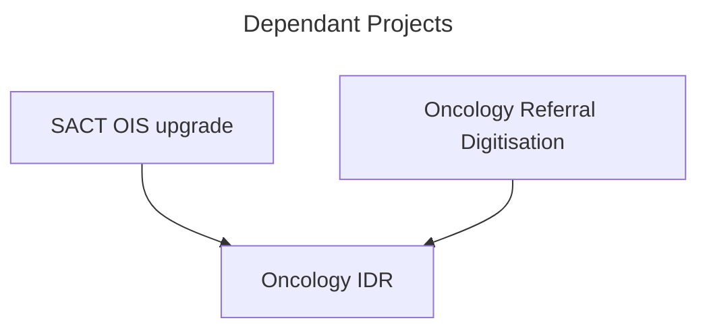

# Project Overview

## Updated Scope
Due to data availability, and current in-flight projects relating to the SACT Oncology Information System, detailed analysis is focused on the Radiotherapy Pathway. 
Architecture has been designed to allow SACT to be added at a later date, as well as updated referral pathways (e.g. designed to that all input is in csv format to maintain consistency across all ETL pathways)



## Updated Working Title
*Design and Evaluation of a Data-Driven Dashboard to Improve Radiotherapy Pathway Performance*

## Aim
To design and evaluate a data driven decision support system that: 
- Identifies delays across oncology -> radiotherapy pathways
- Explains the causes of delay
- Supports real-time operational decision-making

## Current Status
- Fully built Integrated Data Repository (IDR)
- Event-based pathway model (Oncology -RT)
- Tumour classification (ICD-10 mapping)
- Live and predictive risk metrics
- Power BI model designed (ready to build visuals)
Now moving onto:
- Dashboard construction
- Evaluation phase (RQ3)

# Research Questions - Current Progress

## RQ1 - Where do delays occur?
Have built a multi-stage pathway model with explicit intervals:

| Stage           | Metric                |
| --------------- | --------------------- |
| Oncology -> RT  | `days_oncology_to_rt` |
| RT -> Booking   | `days_rt_to_booking`  |
| Booking -> CT   | `days_booking_to_ct`  |
| CT -> Treatment | `days_ct_to_treat`    |
*These are intervals the literature suggests I should look at, but experience says there are additional steps (such as CCO planning, and Physics planning), but IDR design will allow these steps to be added if time. Alternatively I can use the data from these key events to drill down into CT -> treatment interval*

### Contribution
- Full pathway decomposition (rare in NHS dashboards)
- Identifies specific bottlenecks, not just toal delay
### Evidence
- Multiple delay stages measureable
- Distinct variation between tumour groups. 

## RQ2 - What drives delay?

### 1. Clinical Classification
- ICD-10 -> tumour groups
- Rule-based mapping with exclusions
### 2. Operational classification
- `speciality_referred`
### 3. Capacity integration
- Machine utilisation
- Capacity pressure states
### 4. Intake delays (unique contribution)
- Referral -> received -> triage -> clinic
### Key insight
| Driver               | Example                     |
| -------------------- | --------------------------- |
| Pathway inefficiency | speciality =/= tumour group |
| Capacity             | utilisation cs delay        |
| Admin bottlenecks    | referral - received delay   |
### Evidence 
- Large variation in `speciality_referred` (including nulls)
- Significant "non-cancer" population
- Prostate patients dominate RT workload
## Does the dashboard improve decision-making?
Have built:

| Metric                      | Purpose                |
| --------------------------- | ---------------------- |
| `days_to_31_breach`         | forward-looking risk   |
| `predicted_breach_flag`     | early warning          |
| `currently_breaching`       | operational escalation |
| `valid_clinical_delay_flag` | Clinical context       |

### Dashboard capability
Supports:
- Patient prioritisation
- Avoiding unnecessary escalation
- Identification of capacity vs admin issues

### Planned evaluation
Will measure
- time to identify at-risk patients
- Accuracy of prioritisation
- User decision speed

## RQ4 - What design principles are needed?
Design Principles:

## DP1 - Leading indicators (Not retrospective)
implemented via:
```SQL
days_to_31_breach
days_to_62_breach
```

Moves from "what happened" to "what will happen"

## DP2 - Integration of operational and clinical data
Achieved by:
- Capacity data
- Tumour classification
- Referral pathway
Enables:
- Causal analysis
- not just reporting
### DP3 - Event-based pathway modelling
Have built 


Instead of
- aggregated metrics
We have 
- event-driven model

## DP4 - Semantic Clarity

Separation of
- `speciality_referred` (admin)
- `tumour_group` (clinical)
Enables:
- referral errors
- pathway inefficiencies

## DP5 - Auditability and transparency
Achieved through:
- SQL-based transformations
- LATERAL joins (deterministic logic)
- explicit interval calculations

# Artefact Architecture

## Data layer (SQL)
- Staging (ETL scripts)
- Intermediate events (`int_*)
- Fact tables:
	- `fact_rt_pathway
	- `fact_full_pathway` (final analytical table)

## Analytical layer
- Tumour group mapping (ICD-10 rules)
- Pathway intervals
- Risk and compliance logic

## Visualisation layer (in progress)
- Power BI model defined
- Measures designed
- Dashboards ready to build

# Key achievements
### 1. Full pathway visibility
Not just RT - includes intake, booking, planning, treatment

### 2. Delay decomposition
Identifies *where* delay happens

### 3. Clinical contextualisation
Differentiates:
- true breaches
- clinically valid delays
### 4. Predictive capability
Identifies patients before breach occurs

### 5. Generalisable architecture
Can extend to:
- SACT pathways
- other oncology services

# Known issues / Next improvements

## Data quality issues
- Missing `speciality_referred` (~790 records)
- Inconsistent casing (Breast / BREAST / breast)
Plan
- standardise in BI layer
- improve ETL validation
## Tumour mapping coverage
- High "Non-cancer" group (~50%)
Plan:
- refine ICD mapping
- Validate with clinical users

# Next steps

## Immediate 
1. Build BI dashboards
	1. Pathway overview (RQ1)
	2. Root cause (RQ2)
	3. Operational dashboard (RQ3)

## Then
Conduct evaluation:
- usability sessions
- decision-making tasks

## Final phase
Analyse results:
- compare performance with/without dashboard
- validate design principles

# Summary 

At this stage, I have completed the data engineering and analytical modelling components of the artefact. The system now supports detailed pathway analysis, causal investigation of delays, and real-time operational decision-making. The next phase is to implement and evaluate the Power BI dashboard to assess its impact in user decision-making. 


Feedback on methodology - alot of "what" - need more "how". Methodology - include limitations.
Some repetition. chapter 2 - end with image overview. 
Need conceptual model
justify correct methodology. why DSR is appropriate. what else is there? when has DSR been used well in similar scenario? Link each DP to literature. interlink all the chapters. 
Shorter sentences - move from "this study states" to "this study designs... "

to move up marks - expand criticality
