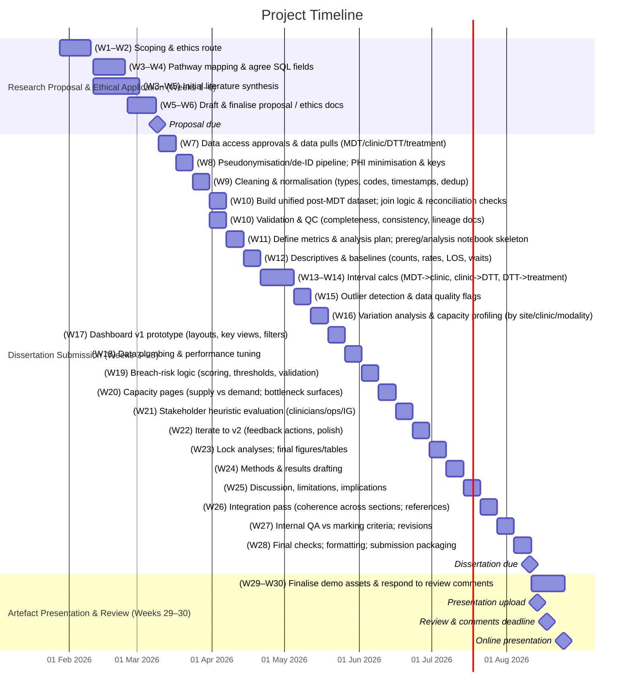

# Proposed MSc Project

## Project Working Title

**Post‑MDT Oncology Workflow Bottlenecks: A Data‑Driven Analysis and Dashboard Prototype to Reduce Delays from MDT Outcome to Treatment Start**

## Significance / Contribution to the Discipline / Research Problem

Timely progression from Multidisciplinary Team (MDT) decision to oncology clinic appointment and treatment initiation is critical for patient outcomes and experience. The NHS cancer waiting time framework now focuses on three outcome‑oriented standards—the 28‑day Faster Diagnosis Standard (FDS), 31‑day decision‑to‑treatment, and 62‑day referral‑to‑treatment — to prioritise faster diagnosis and treatment starts [@johnson2024; @nhsengland2023]. While many improvement efforts concentrate on pre‑MDT diagnostic phases, post‑MDT steps (MDT outcome → first oncology clinic → decision to treat → treatment start) continue to present bottlenecks due to scheduling backlogs, clinic capacity constraints, variable MDT processes, and workforce shortages in oncology services [@aggarwal2024; @roques2024]. 

Policy analyses and national guidance highlight system‑level pressures — workforce, diagnostics and treatment capacity, and unwarranted variation — arguing for data‑driven operational improvements rather than technocentric fixes alone [@aggarwal2024; @sullivan2024]. In parallel, evidence and guidance on MDT streamlining suggest that prioritising complex cases and standardising straightforward ones can release time and reduce downstream delays, but implementation has been mixed and slow across the NHS [@al-hammouri2024; @greatermanchestercanceralliance; @greatermanchestercanceralliance2023 ].

Although diagnostic bottlenecks (e.g., abnormal screen → biopsy; biopsy → pathology report) are well documented and contribute to breaches of the 28‑ and 62‑day standards [@oluyemi2024; @lawson2022], treatment‑capacity constraints and clinic scheduling remain prominent post‑diagnosis issues, especially for SACT delivery and clinic throughput [@roques2024; @nhsengland]. National resources now provide operational data and improvement tools for cancer managers and MDT coordinators—underlining the importance of operational management intelligence to meet FDS and treatment‑time ambitions [@nhsengland; @grift2024].

**Problem in focus:** The Trust lacks a consolidated, actionable view of post‑MDT delays and their drivers. Operational data exist across MDT coordination, clinic scheduling, and treatment systems (available via SQL extracts), but remain siloed. The service requires an integrated analytics and dashboard solution that reveals where post‑MDT delays accumulate, how they impact 31‑ and 62‑day performance, and where to target capacity and process improvements [@nhsengland2023; @johnson2024].

## Research Question

**Primary RQ:**  
Where do delays occur between MDT outcome and the first oncology clinic appointment, and to what extent do these delays influence decision‑to‑treatment and referral‑to‑treatment performance?

**Secondary RQs:**

1. Which operational factors (e.g., clinic slot capacity, consultant caseload distribution, booking intervals) are most strongly associated with extended MDT→clinic waits?
2. How do tumour groups differ in post‑MDT delay patterns and breach risk?
3. Can a dashboard that integrates MDT, clinic, and treatment data improve managers’ ability to identify, prioritise, and monitor post‑MDT bottleneck‑removal actions?

## Aims and Objectives

### Aim

To analyse and visualise post‑MDT oncology workflow performance—identifying bottlenecks from MDT outcome to clinic appointment and on to treatment start—and to develop a dashboard prototype that supports operational decision‑making and pathway optimisation.

### Objectives

1. **Map** the Trust’s post‑MDT pathway using timestamped events (MDT decision, first oncology clinic, decision to treat, treatment start) in line with NCWTMDS definitions where applicable  [@nhsengland2023; @johnson2024].
2. **Ingest and model** de‑identified SQL extracts (MDT outcomes, clinic bookings, treatment start) to compute stage‑to‑stage intervals and identify variation and hotspots [@nhsengland; @grift2024].
3. **Quantify** the contribution of MDT→clinic and clinic→DTT intervals to 31‑ and 62‑day performance and breach risk [@nhsengland2023; @johnson2024] .
4. **Develop** a dashboard with breach‑risk alerts, slot‑utilisation views, and consultant/caseload analytics to guide operational choices [@grift2024; @nhsengland2024].
5. **Evaluate** the dashboard’s usability and utility with service stakeholders (heuristic evaluation) and refine accordingly [@al-hammouri2024; @greatermanchestercanceralliance].

## Key Literature Related to the Project

- **Standards and policy context.** The shift to three standards (FDS 28‑day, 31‑day decision‑to‑treatment, 62‑day referral‑to‑treatment) underscores outcome‑focused performance and the need for integrated pathway management [@nhsengland2023; @johnson2024].
- **System pressures and variation.** UK policy reviews identify workforce and capacity constraints, and variations in quality and access, calling for system‑level improvement strategies [@aggarwal2024; @sullivan2024].
- **MDT efficiency.** Evidence‑based streamlining frameworks prioritise complex cases for full discussion and standardise straightforward ones; slow implementation hampers benefits [@al-hammouri2024; @greatermanchestercanceralliance].
- **Diagnostic and pathology delays.** Diagnostic intervals (e.g., evaluation→biopsy) show wide variability, and pathology turnaround time is a known constraint; NHS case studies demonstrate practical turn around time (TAT) improvements via workflow redesign [@oluyemi2024; @nhsengland2024].
- **Treatment capacity constraints.** SACT and oncology workforce pressures affect timely treatment starts even after timely diagnosis [@roques2024; @aggarwal2024].
- **Operational data infrastructure.** NHS resources for cancer operations provide data, guidance, and benchmarking tools to support improvement programmes [@nhsengland; @grift2024].

Collectively, this literature supports a post‑MDT focus: aligning operational analytics with national standards and MDT reforms to close the gap between decision‑making and treatment commencement.

## Methodology / Development Strategy / Research Design

### Overall approach

A Design Science Research (DSR) methodology will be used: problem identification → data modelling/analysis → artefact (dashboard) design → demonstration → evaluation and reflection [@nhsengland2023; @grift2024].

### Data and variables

- **Sources (via SQL extracts):**
    - **MDT outcomes**: unique pathway ID, MDT date, decision (e.g., refer to medical oncology/radiotherapy/surgery), responsible consultant/team.
    - **Clinic scheduling**: first oncology clinic appointment date/time, clinic type/session, consultant, slot capacity and utilisation.
    - **Treatment events**: decision‑to‑treat (DTT) date (or earliest clinically appropriate date), first definitive treatment start (SACT/RT/surgery).
- **Key intervals:**
    1. **MDT** → **Clinic** (days)
    2. **Clinic** → **DTT** (days)
    3. **DTT** → **Treatment start** (days)
    4. **Referral** → **Treatment start** (62‑day context) where available and appropriate
- **KPIs and benchmarks:** performance against 31‑day and 62‑day standards; proportion approaching breach thresholds; capacity utilisation [@nhsengland2023; @johnson2024]).

### Data handling

- **De‑identification at source** with unique pseudonymous pathway IDs; conform to local data sharing agreements and IG controls [@nhsengland2023; @nhsengland].
- **Event alignment** using NCWTMDS definitions to improve consistency of interval measurement [@nhsengland2023; @grift2024].

### Analysis plan

1. **Descriptive analytics:** medians/IQRs and control charts of post‑MDT intervals by tumour group, clinic, consultant, and time.
2. **Variation and capacity:** funnel plots and utilisation heatmaps to identify under/over‑capacity sessions and mismatch between demand and slots [@grift2024; @nhsengland].
3. **Association modelling:** regression/time‑to‑event models to examine predictors of extended MDT→clinic delays (e.g., clinic capacity, caseload, tumour site), and consequent impact on 31‑/62‑day standards  [@johnson2024; @nhsengland2023].
4. **Scenario testing:** simulate effects of operational changes (e.g., prioritised booking of post‑MDT patients within X days; additional clinic sessions) on breach risk [@al-hammouri2024; @greatermanchestercanceralliance].

### Artefact development (dashboard)

- **Technology:** Power BI or Python Dash (final choice based on Trust tooling and data pipeline).
- **Views:**
    - **Post‑MDT tracker:** real‑time view of MDT→clinic waits; breach‑risk flags tied to 31‑/62‑day clocks [@nhsengland2023; @johnson2024].
    - **Capacity pane:** slot supply vs demand; utilisation by clinic/consultant; next‑available capacity for post‑MDT bookings [@grift2024; @nhsengland].
    - **Interval heatmap:** MDT→clinic, clinic→DTT, DTT→treatment, by tumour group.
    - **Pathway compliance:** run charts vs standards; cohort drill‑downs.

### Evaluation

- **Heuristic usability** review with operational managers/MDT coordinators (non‑participant, no identifiable data).
- **Utility** assessment: number/clarity of “actionable” bottlenecks surfaced, and perceived usefulness for planning clinics and sessions [@al-hammouri2024; @greatermanchestercanceralliance].
- **Validity checks**: reconcile a sample of dashboard metrics with underlying SQL queries; cross‑check interval definitions with NCWTMDS [@nhsengland2023].

## Ethical Considerations and Risk Assessment

- **Data type & approvals:** Secondary operational service data, de‑identified before analysis. The project will seek local approval as service evaluation/operational improvement where appropriate and comply with University ethical procedures before any data handling begins [@nhsengland2023; @johnson2024].
- **Information governance:** Compliance with UK GDPR and Data Protection Act 2018; alignment with NHS IG and Cancer Programme guidance on data use for performance improvement [@nhsengland; @nhsengland2023].
- **Risks & mitigations:**
    - _Data quality/incomplete timestamps:_ early data profiling; clear event definitions (NCWTMDS); iterative query refinement [@nhsengland2023].
    - _Scope creep across tumour sites:_ start with 1–2 high‑volume tumour groups; scale once the model stabilises [@grift2024].
    - _Adoption risk:_ co‑design visuals with stakeholders; map outputs to operational decisions (clinic rostering, slot release, booking rules) [@nhsengland; @al-hammouri2024].

## Description of Artefact(s) to be Created

A decision‑support dashboard for post‑MDT workflow, including:

- **KPI panels** for MDT→clinic, clinic→DTT, DTT→treatment; real‑time breach‑risk indicators for 31‑/62‑day standards.
- **Capacity & utilisation** views (sessions, slots, consultants) to guide clinic planning and prioritisation of post‑MDT bookings.
- **Drill‑downs** by tumour site and consultant; exportable reports for governance meetings.
- **Documentation**: data model, definitions, and governance notes for reproducibility [@nhsengland2023; @grift2024].

## Timeline of Proposed Activities (Aligned to Module Deadlines)

> **Research Proposal & Ethical Application  
> **Due: 23:55, Monday 9 March 2026**

- **Weeks 1–8 (to 9 Mar 2026):** Confirm scope and ethics route; pathway mapping (post‑MDT focus); agree SQL fields; initial literature synthesis; draft & submit proposal [@johnson2024; @nhsengland2023].

> **Dissertation Submission**  
> **Due: 23:55, Monday 10 August 2026**

- **Weeks 9–12 (Mar–Apr 2026):** Data extraction, de‑identification, cleaning; build unified post‑MDT dataset [@nhsengland2023].
- **Weeks 13–18 (Apr–May 2026):** Quantitative analysis of MDT→clinic, clinic→DTT, DTT→treatment; variation and capacity profiling [@grift2024; @nhsengland].
- **Weeks 19–24 (May–Jul 2026):** Dashboard development (v1→v2); breach‑risk logic and capacity pages; stakeholder heuristic evaluation; iterate [@al-hammouri2024].
- **Weeks 25–28 (Jul–Aug 2026):** Final analyses; integrate figures/tables; write‑up and internal QA against marking criteria.

> **Artefact Presentation & Review**  
> **Presentation upload:** 23:55, **Thursday 13 August 2026**  
> **Review & comments:** 23:55, **Monday 17 August 2026**  
> **Online presentation:** 23:55, **Monday 24 August 2026**

- **Weeks 29–30 (Aug 2026):** Finalise demo assets (dashboard walk through, slides), record/present; respond to review comments.

## References

Aggarwal, A. _et al._ (2024) ‘NHS cancer services and systems—ten pressure points a UK cancer control plan needs to address’, _The Lancet Oncology_, 25(8), pp. e363–e373. Available at: [https://doi.org/10.1016/S1470-2045(24)00345-0](https://doi.org/10.1016/S1470-2045\(24\)00345-0).

Al-Hammouri, T. _et al._ (2024) ‘Implementation of streamlining measures in selecting and prioritising complex cases for the cancer multidisciplinary team meeting: a mini review of the recent developments’, _Frontiers in Health Services_, 4. Available at: [https://doi.org/10.3389/frhs.2024.1340320](https://doi.org/10.3389/frhs.2024.1340320).

Greater Manchester Cancer Alliance (2023) _Greater Manchester Cancer MDT Meeting Standards_. Available at: [https://gmcancer.org.uk/wp-content/uploads/2023/06/V3.0-GM-MDT-Standards-June-23.pdf](https://gmcancer.org.uk/wp-content/uploads/2023/06/V3.0-GM-MDT-Standards-June-23.pdf) (Accessed: 13 February 2026).

Greater Manchester Cancer Alliance (no date) _The Multidiciplanary Team (MDT) Meeting Reform Toolkit_. Greater Manchester Cancer. Available at: [https://gmcancer.org.uk/wp-content/uploads/2023/05/MDT-Reform-Toolkit.pdf](https://gmcancer.org.uk/wp-content/uploads/2023/05/MDT-Reform-Toolkit.pdf) (Accessed: 13 February 2026).

GRIFT and NHS England (2024) _Best Practice Timed Diagnostic Cancer Pathways_. NHS Impact. Available at: [https://gettingitrightfirsttime.co.uk/wp-content/uploads/2024/03/BestPracticeTimedDiagnosticCancerPathwayssummary-guide-March-24-V3.pdf](https://gettingitrightfirsttime.co.uk/wp-content/uploads/2024/03/BestPracticeTimedDiagnosticCancerPathwayssummary-guide-March-24-V3.pdf) (Accessed: 2 October 2026).

Johnson, P. (2024) ‘Updating the NHS cancer waiting time standards’, _BMJ Oncology_, 3(1). Available at: [https://doi.org/10.1136/bmjonc-2024-000337](https://doi.org/10.1136/bmjonc-2024-000337).

Lawson, M.B. _et al._ (2022) ‘Multilevel Factors Associated With Time to Biopsy After Abnormal Screening Mammography Results by Race and Ethnicity’, _JAMA Oncology_, 8(8), pp. 1115–1126. Available at: [https://doi.org/10.1001/jamaoncol.2022.1990](https://doi.org/10.1001/jamaoncol.2022.1990).

NHS England (2023) _National Cancer Waiting Times Monitoring Dataset Guidance V12.0_. PRN00654. Available at: [https://www.england.nhs.uk/wp-content/uploads/2023/08/PRN00654-national-cancer-waiting-times-monitoring-dataset-guidance-v12.pdf](https://www.england.nhs.uk/wp-content/uploads/2023/08/PRN00654-national-cancer-waiting-times-monitoring-dataset-guidance-v12.pdf) (Accessed: 30 January 2026).

NHS England (2024) _Case study: improving turnaround times in pathology_. NHS England. Available at: [https://www.england.nhs.uk/long-read/case-study-improving-turnaround-times-in-pathology/](https://www.england.nhs.uk/long-read/case-study-improving-turnaround-times-in-pathology/) (Accessed: 13 February 2026).

NHS England (no date) _Operational management, administration and performance_. Available at: [https://www.england.nhs.uk/cancer/operational-management-administration-and-performance/](https://www.england.nhs.uk/cancer/operational-management-administration-and-performance/) (Accessed: 13 February 2026).

Oluyemi, E.T. _et al._ (2024) ‘Rate and Timeliness of Diagnostic Evaluation and Biopsy After Recall From Screening Mammography in the National Mammography Database’, _Journal of the American College of Radiology_, 21(3), pp. 427–438. Available at: [https://doi.org/10.1016/j.jacr.2023.09.002](https://doi.org/10.1016/j.jacr.2023.09.002).

Roques, T. (2024) ‘Addressing the capacity crisis in oncology, progress and ongoing concerns | The Royal College of Radiologists’, _Royal College of Radiologists_, 17 January. Available at: [https://www.rcr.ac.uk/news-policy/latest-updates/addressing-the-capacity-crisis-in-oncology-progress-and-ongoing-concerns/](https://www.rcr.ac.uk/news-policy/latest-updates/addressing-the-capacity-crisis-in-oncology-progress-and-ongoing-concerns/) (Accessed: 10 February 2026).

Sullivan, R. (2024) _10 cancer challenges facing the new government_, _King’s College London_. Available at: [https://www.kcl.ac.uk/news/the-10-cancer-challenges-facing-the-new-government](https://www.kcl.ac.uk/news/the-10-cancer-challenges-facing-the-new-government) (Accessed: 13 February 2026).