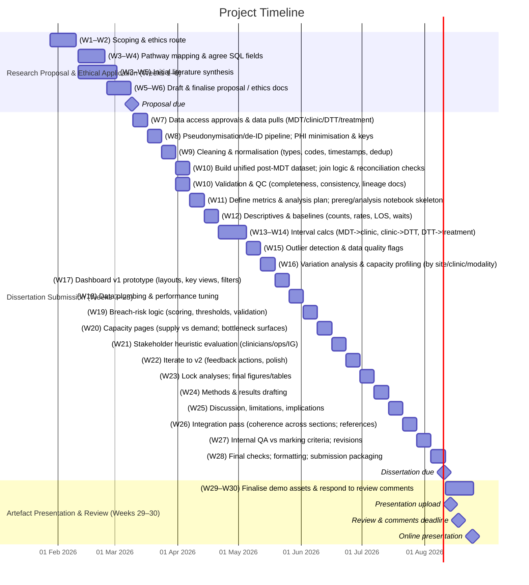

# Proposed MSc Project

## Project Working Title

**Post‑MDT Oncology Workflow Bottlenecks: A Data‑Driven Analysis and Dashboard Prototype to Reduce Delays from MDT Outcome to Treatment Start**

## Significance / Contribution to the Discipline / Research Problem

The project addresses a recognised gap in the operational management of post-MDT oncology workflows: while data relevant to scheduling, MDT coordination, and treatment planning exist, they are distributed across siloed clinical and administrative systems. As highlighted in recent research on Integrated Data Repositories (IDR) for clinical decision-support, fragmented data environments limit the ability to generate timely operational insights and implement system-level optimisation [@gagalova2020]. 

**This project contributes new knowledge in three ways:**

1. **Conceptual Contribution:**

It proposes a *Post-MDT Integrated Operational Data Repository* model - adapting IDR principles for an operational, rather than clinical research, context. This contributes to IS literature on health analytics by demonstrating how IDR can support real-time pathway optimisation in cancer services. 

2. **Methodological Contribution:**

The work applies Design Science Research (DSR) within an NHS operational environment using a structured framework [@Peffers2007; @hevner2004].
- It contributes a replicable data integration and modelling methodology for timestamp-rich workflow data.
- It offers data quality handling strategies tailored to incomplete or inconsistent cancer waiting times data. 
- It provides generalisable evaluation methods for analytics artefacts aimed at operational decision making. 

3. **Design Contribution:**

From the artefact development and evaluation, the project will derive explicit, transferable design principles for data-driven operational dashboards (e.g. alert framing, temporal interval visualisation, breach-risk signal design, cascade filtering). These may be generalised to other pathway-based NHS workflows beyond oncology.

**Problem in focus:** The Trust lacks a consolidated, actionable view of post‑MDT delays and their drivers. Operational data exist across MDT coordination, clinic scheduling, and treatment systems (available via SQL extracts), but remain siloed. The service requires an integrated analytics and dashboard solution that reveals where post‑MDT delays accumulate, how they impact 31‑ and 62‑day performance, and where to target capacity and process improvements [@nhsengland2023; @johnson2024].

## Research Question

**Primary RQ:**  
Where do delays occur between MDT outcome and the first oncology clinic appointment, and to what extent do these delays influence decision‑to‑treatment and referral‑to‑treatment performance?

**Secondary RQs:**

1. Which operational factors (e.g., clinic slot capacity, consultant caseload distribution, booking intervals) are most strongly associated with extended MDT→clinic waits?
2. How do tumour groups differ in post‑MDT delay patterns and breach risk?
3. To what extent does the prototype dashboard improve users’ task performance—specifically accuracy, speed, and confidence—in identifying and prioritising post‑MDT workflow bottlenecks, compared with current tools or processes?

## Aims and Objectives

### Aim

To analyse and visualise post‑MDT oncology workflow performance—identifying bottlenecks from MDT outcome to clinic appointment and on to treatment start—and to develop a dashboard prototype that supports operational decision‑making and pathway optimisation.

### Objectives

1. **Map** the Trust’s post‑MDT pathway using timestamped events (MDT decision, first oncology clinic, decision to treat, treatment start) in line with NCWTMDS definitions where applicable  [@nhsengland2023; @johnson2024].
2. **Ingest and model** de‑identified SQL extracts (MDT outcomes, clinic bookings, treatment start) to compute stage‑to‑stage intervals and identify variation and hotspots [@nhsengland; @grift2024].
3. **Quantify** the contribution of MDT→clinic and clinic→DTT intervals to 31‑ and 62‑day performance and breach risk [@nhsengland2023; @johnson2024] .
4. **Develop** a dashboard with breach‑risk alerts, slot‑utilisation views, and consultant/caseload analytics to guide operational choices [@grift2024; @nhsengland2024].
5. **Evaluate** the dashboard’s usability and utility with service stakeholders (heuristic evaluation) and refine accordingly [@al-hammouri2024; @greatermanchestercanceralliance].

## Key Literature Related to the Project

- **Standards and policy context.** The shift to three standards (FDS 28‑day, 31‑day decision‑to‑treatment, 62‑day referral‑to‑treatment) underscores outcome‑focused performance and the need for integrated pathway management [@nhsengland2023; @johnson2024].
- **System pressures and variation.** UK policy reviews identify workforce and capacity constraints, and variations in quality and access, calling for system‑level improvement strategies [@aggarwal2024; @sullivan2024].
- **MDT efficiency.** Evidence‑based streamlining frameworks prioritise complex cases for full discussion and standardise straightforward ones; slow implementation hampers benefits [@al-hammouri2024; @greatermanchestercanceralliance].
- **Diagnostic and pathology delays.** Diagnostic intervals (e.g., evaluation→biopsy) show wide variability, and pathology turnaround time is a known constraint; NHS case studies demonstrate practical turn around time (TAT) improvements via workflow redesign [@oluyemi2024; @nhsengland2024].
- **Treatment capacity constraints.** SACT and oncology workforce pressures affect timely treatment starts even after timely diagnosis [@roques2024; @aggarwal2024].
- **Operational data infrastructure.** NHS resources for cancer operations provide data, guidance, and benchmarking tools to support improvement programmes [@nhsengland; @grift2024].

Collectively, this literature supports a post‑MDT focus: aligning operational analytics with national standards and MDT reforms to close the gap between decision‑making and treatment commencement.

## Methodology / Development Strategy / Research Design

### Overall approach

The study applies a Design Science Research (DSR) methodology structured using the @Peffers2007 framework (problem identification; define objectives; design and development; demonstration; evaluation; communication). Elements of @hevner2004 IS research guidlines will ensure relevance, rigour, and artefact utility. Anchoring the project in these recognised DSR frameworks establishes methodological robustness. 

### Data and variables

- **Sources (via SQL extracts):**
    - **MDT outcomes**: unique pathway ID, MDT date, decision (e.g., refer to medical oncology/radiotherapy/surgery), responsible consultant/team.
    - **Clinic scheduling**: first oncology clinic appointment date/time, clinic type/session, consultant, slot capacity and utilisation.
    - **Treatment events**: decision‑to‑treat (DTT) date (or earliest clinically appropriate date), first definitive treatment start (SACT/RT/surgery).
- **Key intervals:**
    1. **MDT** → **Clinic** (days)
    2. **Clinic** → **DTT** (days)
    3. **DTT** → **Treatment start** (days)
    4. **Referral** → **Treatment start** (62‑day context) where available and appropriate
- **KPIs and benchmarks:** performance against 31‑day and 62‑day standards; proportion approaching breach thresholds; capacity utilisation [@nhsengland2023; @johnson2024]).

### Data handling

Data quality procedures will explicitly address timestamp gaps and inconsistencies - a common weakness in cancer operational datasets ==citation needed==

1. **Profiling:** completeness checks, temporal ordering validation, and detection of impossible intervals (negative or implausibly long duration's).
2. **Timestamp reconciliation:** where multiple fields exist (e.g. clinic booking vs attendance), apply NCWTMDS hierarchy rules. 
3. **Missing-data strategy:**
	1. MCAR/MAR assessment using Little's test.
	2. Multiple imputation for partially missing event dates where clinically and operationally valid
	3. Listwise exclusion for cases failing quality thresholds (pre-defined).
4. **Documentation:** all data cleaning decisions logged to support reproducibility.
5. **De‑identification at source** with unique pseudonymous pathway IDs; conform to local data sharing agreements and IG controls [@nhsengland2023; @nhsengland].

### Analysis plan

1. **Descriptive analytics:** medians/IQRs and control charts of post‑MDT intervals by tumour group, clinic, consultant, and time.
2. **Variation and capacity:** funnel plots and utilisation heatmaps to identify under/over‑capacity sessions and mismatch between demand and slots [@grift2024; @nhsengland].
3. **Association modelling:** Multi-variable linear regression for continuous intervals (MDT -> clinic -> DTT); Logistic regression for breach/non-breach outcomes; Cox proportional hazards models for time-to-event patterns where appropriate; Use of AI/BIC and cross-validation to assess model fit; Sensitivity analyses excluding extreme timestamp outliers.
4. regression/time‑to‑event models to examine predictors of extended MDT→clinic delays (e.g., clinic capacity, caseload, tumour site), and consequent impact on 31‑/62‑day standards  [@johnson2024; @nhsengland2023].
5. **Exploratory scenario analysis:**  Using the integrated dataset, exploratory simulations will illustrate potential directional effects of operational changes (e.g., adding clinic capacity or altering booking rules). These models are explicitly non‑predictive and not intended for forecasting. Their purpose is to support understanding of system behaviour rather than assert causal claims.

### Artefact development (dashboard)

- **Technology:** Power BI or Python Dash (final choice based on Trust tooling and data pipeline).
- **Views:**
    - **Post‑MDT tracker:** real‑time view of MDT→clinic waits; breach‑risk flags tied to 31‑/62‑day clocks [@nhsengland2023; @johnson2024].
    - **Capacity pane:** slot supply vs demand; utilisation by clinic/consultant; next‑available capacity for post‑MDT bookings [@grift2024; @nhsengland].
    - **Interval heatmap:** MDT→clinic, clinic→DTT, DTT→treatment, by tumour group.
    - **Pathway compliance:** run charts vs standards; cohort drill‑downs.

### Evaluation

Evaluation will use a multi‑method approach aligned with DSR guidelines (Peffers et al., 2007; Hevner, 2004):

1. **Usability Testing (Task‑Based):**  
    Participants complete predefined tasks (e.g., identify longest MDT→clinic bottleneck; detect next week’s breach risk).  
    – Measures: task accuracy, completion time, error rate, confidence ratings.
    
2. **Utility Assessment (Decision‑Making Effectiveness):**  
    Compare decisions made with vs without the dashboard using realistic operational scenarios.  
    – Measures: decision quality, prioritisation accuracy, consistency.
    
3. **Technical Validation:**  
    – Reconciliation of dashboard metrics with raw SQL outputs.  
    – Verification against NCWTMDS rules for interval definitions.
    
4. **Heuristic Evaluation:**  
    Conduct Nielsen‑based expert review to assess layout, clarity, and interaction design.
    
5. **Qualitative Feedback:**  
    Semi‑structured interviews with stakeholders to assess perceived usefulness and alignment with workflow needs.
    

**Outputs:** A triangulated evaluation producing both quantitative performance metrics and qualitative insights—meeting MSc‑level rigour expectations.

## Ethical Considerations and Risk Assessment

- **Data type & approvals:** Secondary operational service data, de‑identified before analysis. The project will seek local approval as service evaluation/operational improvement where appropriate and comply with University ethical procedures before any data handling begins [@nhsengland2023; @johnson2024].
- **Information governance:** Compliance with UK GDPR and Data Protection Act 2018; alignment with NHS IG and Cancer Programme guidance on data use for performance improvement [@nhsengland; @nhsengland2023].
- **Risks & mitigations:**
    - _Data quality/incomplete timestamps:_ early data profiling; clear event definitions (NCWTMDS); iterative query refinement [@nhsengland2023].
    - _Scope creep across tumour sites:_ start with 1–2 high‑volume tumour groups; scale once the model stabilises [@grift2024].
    - _Adoption risk:_ co‑design visuals with stakeholders; map outputs to operational decisions (clinic rostering, slot release, booking rules) [@nhsengland; @al-hammouri2024].

## Description of Artefact(s) to be Created

A decision‑support dashboard for post‑MDT workflow, including:

The artefact is a Design‑Science‑informed decision‑support dashboard built on an **Integrated Post‑MDT Operational Data Repository (IDR)**. Core features:

1. **Data Layer (IDR):**  
    – Unified model integrating MDT, clinic, and treatment events.  
    – Timestamp validation rules and interval‑calculation logic.  
    – Reusable schema for other tumour sites or Trusts.
    
2. **Design Principles (derived and evaluated):**  
    – _Principle of Temporal Transparency:_ visualisation must expose variation in sequential intervals.  
    – _Principle of Breach‑Proximity Signalling:_ alerts emphasise trajectory relative to 31‑ and 62‑day thresholds.  
    – _Principle of Operational Prioritisation:_ views must support ranking by actionable constraints (capacity, caseload).  
    – _Principle of Cohort Drill‑Down:_ high‑level risk indicators must link to patient‑level detail (pseudonymised).
    
3. **Dashboard Views:**  
    – Post‑MDT tracker with breach‑risk trajectories.  
    – Capacity utilisation and slot-availability model.  
    – Tumour‑group heatmaps and consultant‑caseload views.  
    – Filters, drilldowns, and exportable operational reports.

## Timeline of Proposed Activities (Aligned to Module Deadlines)

> **Research Proposal & Ethical Application  
> **Due: 23:55, Monday 9 March 2026**

- **Weeks 1–8 (to 9 Mar 2026):** Confirm scope and ethics route; pathway mapping (post‑MDT focus); agree SQL fields; initial literature synthesis; draft & submit proposal [@johnson2024; @nhsengland2023].

> **Dissertation Submission**  
> **Due: 23:55, Monday 10 August 2026**

- **Weeks 9–12 (Mar–Apr 2026):** Data extraction, de‑identification, cleaning; build unified post‑MDT dataset [@nhsengland2023].
- **Weeks 13–18 (Apr–May 2026):** Quantitative analysis of MDT→clinic, clinic→DTT, DTT→treatment; variation and capacity profiling [@grift2024; @nhsengland].
- **Weeks 19–24 (May–Jul 2026):** Dashboard development (v1→v2); breach‑risk logic and capacity pages; stakeholder heuristic evaluation; iterate [@al-hammouri2024].
- **Weeks 25–28 (Jul–Aug 2026):** Final analyses; integrate figures/tables; write‑up and internal QA against marking criteria.

> **Artefact Presentation & Review**  
> **Presentation upload:** 23:55, **Thursday 13 August 2026**  
> **Review & comments:** 23:55, **Monday 17 August 2026**  
> **Online presentation:** 23:55, **Monday 24 August 2026**

- **Weeks 29–30 (Aug 2026):** Finalise demo assets (dashboard walk through, slides), record/present; respond to review comments.

## References

Aggarwal, A. _et al._ (2024) ‘NHS cancer services and systems—ten pressure points a UK cancer control plan needs to address’, _The Lancet Oncology_, 25(8), pp. e363–e373. Available at: [https://doi.org/10.1016/S1470-2045(24)00345-0](https://doi.org/10.1016/S1470-2045\(24\)00345-0).

Al-Hammouri, T. _et al._ (2024) ‘Implementation of streamlining measures in selecting and prioritising complex cases for the cancer multidisciplinary team meeting: a mini review of the recent developments’, _Frontiers in Health Services_, 4. Available at: [https://doi.org/10.3389/frhs.2024.1340320](https://doi.org/10.3389/frhs.2024.1340320).

Greater Manchester Cancer Alliance (2023) _Greater Manchester Cancer MDT Meeting Standards_. Available at: [https://gmcancer.org.uk/wp-content/uploads/2023/06/V3.0-GM-MDT-Standards-June-23.pdf](https://gmcancer.org.uk/wp-content/uploads/2023/06/V3.0-GM-MDT-Standards-June-23.pdf) (Accessed: 13 February 2026).

Greater Manchester Cancer Alliance (no date) _The Multidiciplanary Team (MDT) Meeting Reform Toolkit_. Greater Manchester Cancer. Available at: [https://gmcancer.org.uk/wp-content/uploads/2023/05/MDT-Reform-Toolkit.pdf](https://gmcancer.org.uk/wp-content/uploads/2023/05/MDT-Reform-Toolkit.pdf) (Accessed: 13 February 2026).

GRIFT and NHS England (2024) _Best Practice Timed Diagnostic Cancer Pathways_. NHS Impact. Available at: [https://gettingitrightfirsttime.co.uk/wp-content/uploads/2024/03/BestPracticeTimedDiagnosticCancerPathwayssummary-guide-March-24-V3.pdf](https://gettingitrightfirsttime.co.uk/wp-content/uploads/2024/03/BestPracticeTimedDiagnosticCancerPathwayssummary-guide-March-24-V3.pdf) (Accessed: 2 October 2026).

Johnson, P. (2024) ‘Updating the NHS cancer waiting time standards’, _BMJ Oncology_, 3(1). Available at: [https://doi.org/10.1136/bmjonc-2024-000337](https://doi.org/10.1136/bmjonc-2024-000337).

Lawson, M.B. _et al._ (2022) ‘Multilevel Factors Associated With Time to Biopsy After Abnormal Screening Mammography Results by Race and Ethnicity’, _JAMA Oncology_, 8(8), pp. 1115–1126. Available at: [https://doi.org/10.1001/jamaoncol.2022.1990](https://doi.org/10.1001/jamaoncol.2022.1990).

NHS England (2023) _National Cancer Waiting Times Monitoring Dataset Guidance V12.0_. PRN00654. Available at: [https://www.england.nhs.uk/wp-content/uploads/2023/08/PRN00654-national-cancer-waiting-times-monitoring-dataset-guidance-v12.pdf](https://www.england.nhs.uk/wp-content/uploads/2023/08/PRN00654-national-cancer-waiting-times-monitoring-dataset-guidance-v12.pdf) (Accessed: 30 January 2026).

NHS England (2024) _Case study: improving turnaround times in pathology_. NHS England. Available at: [https://www.england.nhs.uk/long-read/case-study-improving-turnaround-times-in-pathology/](https://www.england.nhs.uk/long-read/case-study-improving-turnaround-times-in-pathology/) (Accessed: 13 February 2026).

NHS England (no date) _Operational management, administration and performance_. Available at: [https://www.england.nhs.uk/cancer/operational-management-administration-and-performance/](https://www.england.nhs.uk/cancer/operational-management-administration-and-performance/) (Accessed: 13 February 2026).

Oluyemi, E.T. _et al._ (2024) ‘Rate and Timeliness of Diagnostic Evaluation and Biopsy After Recall From Screening Mammography in the National Mammography Database’, _Journal of the American College of Radiology_, 21(3), pp. 427–438. Available at: [https://doi.org/10.1016/j.jacr.2023.09.002](https://doi.org/10.1016/j.jacr.2023.09.002).

Roques, T. (2024) ‘Addressing the capacity crisis in oncology, progress and ongoing concerns | The Royal College of Radiologists’, _Royal College of Radiologists_, 17 January. Available at: [https://www.rcr.ac.uk/news-policy/latest-updates/addressing-the-capacity-crisis-in-oncology-progress-and-ongoing-concerns/](https://www.rcr.ac.uk/news-policy/latest-updates/addressing-the-capacity-crisis-in-oncology-progress-and-ongoing-concerns/) (Accessed: 10 February 2026).

Sullivan, R. (2024) _10 cancer challenges facing the new government_, _King’s College London_. Available at: [https://www.kcl.ac.uk/news/the-10-cancer-challenges-facing-the-new-government](https://www.kcl.ac.uk/news/the-10-cancer-challenges-facing-the-new-government) (Accessed: 13 February 2026).